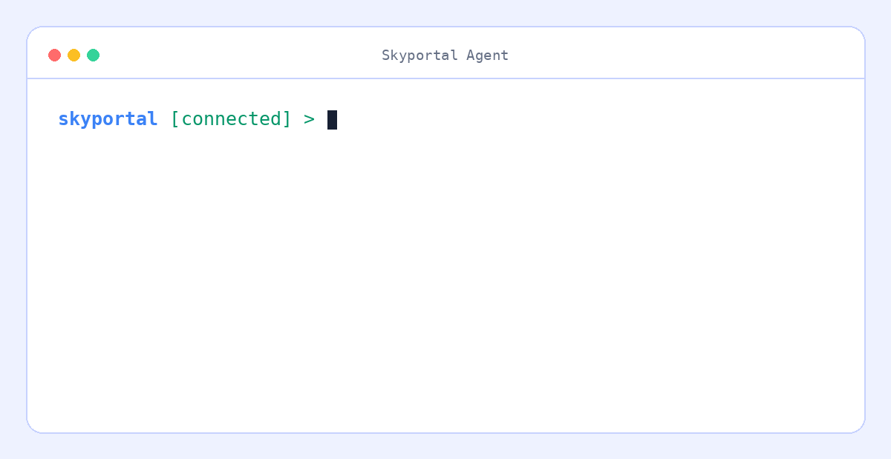

# Skyportal Agent

[](https://github.com/SkyportalAi/skyportalai/actions/workflows/ci.yml)
[](LICENSE)

An open-source AI infrastructure engineer that explains what changed before
production breaks.



Skyportal continuously builds a timeline of your AI infrastructure by observing
deployments, Kubernetes events, GPU metrics, configuration changes, logs, and
infrastructure updates. It correlates those events across your stack and
explains likely root causes.

Instead of searching through dozens of dashboards, ask:

- Why did GPU utilization suddenly drop?
- What changed before latency doubled?
- Which deployment caused this regression?
- Why is this model suddenly slower?
- Have we seen this incident before?

## How it works

```text
Observe infrastructure → Build a change timeline → Correlate regressions → Explain the likely cause
```

Skyportal connects a symptom to the changes that preceded it. A diagnosis can
compare a deployment with its previous release, measure the impact, identify
the most likely change, and report its confidence.

## Works with


## Get started

Requires Python 3.11 or newer.

```bash
git clone https://github.com/SkyportalAi/skyportalai.git
cd skyportalai
./run.sh
```

Inside the terminal, run `/login` once, list infrastructure with `/servers`,
select one or more hosts with `/server`, and ask what changed:

```text
skyportal [connected] > diagnose the latest deployment
```

Useful commands:

```text
/login          Connect your Skyportal account
/servers        List available infrastructure
/server <id> [id ...]  Select one or more servers; the first is the default
/permission [ask|autoapprove]  Show or change the shared approval setting
/status         Show the active context
/new            Start a new investigation
/resume         Continue the previous investigation
/help           Show every command
```

## Python SDK

Use the SDK when you want to start or automate an investigation from Python:

```python
from skyportalai import Skyportal

with Skyportal(api_key="sk-...") as client:
    client.set_permission_mode("autoapprove")
    chat = client.chat.create_chat(
        "What changed before GPU utilization dropped?",
        server_id=12,
    )
    result = chat.wait()
    print(result.status)
```

`ask` is the default. `autoapprove` submits each concrete approval through the
normal audited approval endpoint; it does not bypass read-only environments,
server scope, repository denials, or other backend safety policy. An explicit
`on_approval` callback takes precedence over the stored account setting. Waits
are indefinite by default so long-running single-host, multi-host, and
Kubernetes turns can finish; pass `timeout=` when an automation job needs a
finite deadline.

To make the full multi-host scope available to the first turn, create the chat
with repeatable server scope and an active default:

```python
with Skyportal(api_key="sk-...") as client:
    chat = client.chat.create_chat(
        "Compare GPU health on all selected hosts",
        server_ids=[12, 18],
        active_server_id=12,
        selected_namespaces={18: ["default", "vllm"]},
    )
    result = chat.wait(on_approval=lambda approval: True)
```

The scope is an allowlist: the active server handles an ambiguous command, and
the agent broadcasts only when the prompt explicitly targets all selected
hosts. Use `{"18": ["__all__"]}` for every Kubernetes namespace, omit
`selected_namespaces` when no Kubernetes scope is needed, and use
`chat.select_servers(...)` between turns to replace an existing chat's scope.
When replacing scope, omitting namespace data preserves retained selections
while `{}` clears them. The singular `server_id=12` creation form remains
supported.

Set `SKYPORTAL_API_KEY` instead of passing a key directly. The client also
supports `SKYPORTAL_BASE_URL` for self-hosted deployments.

## Automation

The `skyportalai` command provides stable JSON output for scripts and CI:

```bash
skyportalai chat send --server 12 --wait "Diagnose the latest regression"
skyportalai chat send --server 12 --server 18 \
  --namespace 18=default --namespace 18=vllm --wait \
  "Compare GPU health on all selected hosts"
skyportalai --json chat messages 123
```

Set the full scope of an existing chat between turns with repeatable `--server`
options:

```bash
skyportalai chat select-servers 123 \
  --server 12 --server 18 --active-server 12 \
  --namespace 18=default --namespace 18=vllm
skyportalai chat send --chat-id 123 --wait "Compare all selected hosts"
```

Use `--clear-scope` to remove every selected server explicitly.

Run `skyportalai --help` for the complete command reference.

## Kubernetes clusters

Connect a cluster with its kubeconfig. The CLI sends the credential only to the
authenticated SkyPortal API, where the same validation and encrypted storage as
the web application are used; kubeconfigs are never returned by lifecycle APIs.

```bash
skyportalai kubernetes connect production --kubeconfig ~/.kube/config --environment Production
skyportalai kubernetes list
```

Use the returned cluster ID as a normal chat target. Namespace scope is an
allowlist and every mutating command keeps the existing approval gate:

```bash
skyportalai chat send --server 17 --namespace 17=default --wait \
  "Restart the api deployment and verify the rollout"
```

Remove the stored cluster credential when it is no longer needed:

```bash
skyportalai kubernetes disconnect 17
```

## Ansible playbooks

Store validated playbooks in SkyPortal and reuse them across account-owned SSH
targets. List responses omit YAML bodies; `show` retrieves one playbook when
you need to inspect or edit it.

```bash
skyportalai ansible create bootstrap --file playbook.yml --description "Base host setup"
skyportalai ansible list
skyportalai ansible show 4
skyportalai ansible update 4 --file playbook.yml
```

Deployments run through the ops agent and the normal command-approval policy.
The playbook executes on the selected SSH host with a temporary, mode-restricted
file that is removed after `ansible-playbook` exits.

```bash
skyportalai ansible deploy 4 --server 12
skyportalai chat wait 91
skyportalai chat approve 91 APPROVAL_ID --command "COMMAND_FROM_STATUS"
skyportalai ansible delete 4 --yes
```

The Python SDK exposes the same lifecycle as `client.ansible.create(...)`,
`.list()`, `.get(...)`, `.update(...)`, `.deploy(...)`, and `.delete(...)`.

## Observability agent

Install the collector dependencies and review the deployment guide before
running the agent on experiment volumes:

```bash
pip install "skyportalai[agent]"
```

See [agent deployment and data handling](docs/agent.md).

## Development

```bash
poetry install --all-extras
poetry run pytest
poetry run ruff check .
poetry check --strict
```

See [CONTRIBUTING.md](CONTRIBUTING.md) to contribute. Report security issues
privately using [SECURITY.md](SECURITY.md).

## License

[MIT](LICENSE)
